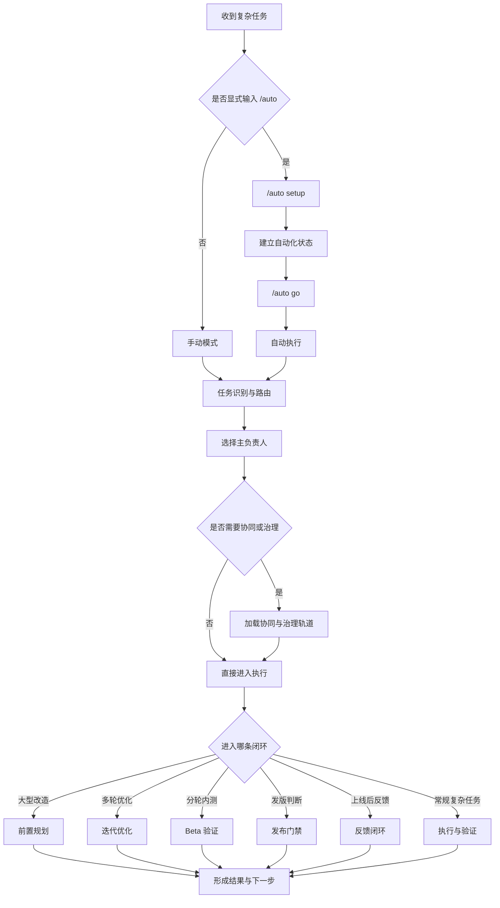

# Virtual Intelligent Dev Team

`virtual-intelligent-dev-team` 是一个面向复杂软件工作的智能协作项目。

它不只是“专家角色路由器”，而是把研发、产品、分轮内测、技术治理、发布门禁、显式 `/auto` 自动运行，以及状态驱动恢复，收拢成一个可持续迭代的闭环工作流。

一句话说：

它适合接手“单个专家已经不够、单轮回答也不够”的复杂软件任务。

## 项目定位

这个项目最适合三类问题：

- 复杂研发交付
  - 例如大重构、迁移、跨模块联动、技术治理
- 产品与研发协同
  - 例如需求澄清、验收标准、前后端协作、分轮 beta
- 版本与闭环治理
  - 例如多轮优化、release gate、post-release feedback loop、resume

## 为什么不是普通多专家提示词

很多“虚拟团队”方案，主要解决的是“换几个角色来回答”。

这个项目想解决得更深一层：

- 不只换角色
  - 还要判断谁主负责、谁协同、是否需要治理
- 不只给建议
  - 还要给出执行路径、恢复锚点和下一步
- 不只做开发前
  - 还覆盖 beta、release、post-release feedback
- 不只做单轮问答
  - 还支持有边界的多轮优化和状态恢复

所以它更像一个“复杂软件工作的闭环协调层”，而不是一个“多身份回答器”。

## 适合解决什么问题

- 复杂研发任务的 lead agent 路由与协同
- 大型重构、迁移、拆分、技术治理
- 多轮优化、benchmark、回滚、resume
- 产品定义、验收标准、分轮 beta 内测
- release gate 与 post-release feedback loop
- 显式 `/auto` 自动运行与状态优先恢复

## 核心能力

- `默认手动模式`
  - 默认是人工驱动模式，不会擅自进入自动运行。
- `显式 /auto`
  - 只有显式输入 `/auto` 才会进入自动运行分支。
- `setup -> go`
  - 自动运行保持两阶段协议，先建状态，再执行。
- `safe / background / resume`
  - 自动子协议支持安全预演、后台执行、状态恢复。
- `状态优先恢复`
  - 恢复优先读取机器可读的 automation state，而不是靠对话猜测上下文。
- `有边界的迭代优化`
  - 优化循环是有边界、有证据、有回滚点的，不做无限自转。
- `发布与反馈闭环`
  - 不只做发布前 gate，也覆盖发布后的反馈回写与下一轮修复入口。

## 能力矩阵

| 维度 | 本项目提供什么 | 普通多专家提示词常见缺口 |
| --- | --- | --- |
| 任务路由 | 选择主负责人、协同者、治理轨道 | 往往只是平铺多个角色视角 |
| 执行模式 | 支持手动模式与显式 `/auto` | 通常没有明确模式切换 |
| 恢复能力 | 状态优先恢复、resume、恢复锚点 | 容易依赖上下文记忆 |
| 迭代能力 | 有边界的多轮优化、基线、回滚决策 | 常见问题是无限“再来一轮” |
| 发布治理 | release gate、hold 后续修复入口 | 常停留在“建议发/不发” |
| 上线后闭环 | post-release feedback loop | 很少覆盖上线后的反馈回写 |
| 产品协同 | 支持产品、研发、技术治理联动 | 容易偏单一研发视角 |

## 快速开始

如果你第一次使用，建议从这三种方式开始：

```text
$virtual-intelligent-dev-team 帮我接管这次重构，并给出可执行分工。
$virtual-intelligent-dev-team /auto setup 这个项目级迁移。
$virtual-intelligent-dev-team 判断当前版本是否可以 release。
```

对应的理解方式是：

- 不带 `/auto`
  - 走手动模式，适合高风险任务和需要逐轮确认的场景
- 带 `/auto setup`
  - 先建立自动化状态和恢复锚点
- 再执行 `/auto go`
  - 进入自动执行阶段

## 适合与不适合

更适合：

- 复杂研发任务
- 跨产品与研发的交付协同
- 需要多轮优化、恢复和发布治理的工作

不太适合：

- 纯商业战略
- 融资、定价、泛咨询
- 非软件交付型的轻量一次性问题

## 目录结构

```text
virtual-intelligent-dev-team/
├── SKILL.md
├── README.md
├── VERSION
├── agents/
├── assets/
├── docs/
├── evals/
├── references/
├── scripts/
└── tests/
```

目录职责分层：

- `SKILL.md`
  - 运行时契约、触发边界、主流程
- `docs/`
  - 面向维护者与开源使用者的说明文档
- `references/`
  - 路由规则、playbook、schema、真源细则
- `assets/`
  - 模板、样例、卡片
- `scripts/`
  - 校验、导出、自动运行、恢复、发布辅助脚本
- `tests/`
  - 语义回归与契约测试

## 快速入口

- 使用说明：
  - [docs/usage-guide.md](docs/usage-guide.md)
- 设计理念：
  - [docs/design-philosophy.md](docs/design-philosophy.md)
- 文档索引：
  - [docs/README.md](docs/README.md)

如果你想先上手：

- 读 `README.md`
- 再读 `docs/usage-guide.md`

如果你想先理解设计：

- 读 `docs/design-philosophy.md`
- 再读 `SKILL.md`

## 运行流程图



## 如何调用

最常见的调用方式：

```text
$virtual-intelligent-dev-team 帮我接管这次重构，并给出可执行分工。
$virtual-intelligent-dev-team /auto setup 这个项目级迁移。
$virtual-intelligent-dev-team 判断当前版本是否可以 release。
```

如果你主要关心运行时规则，优先读：

- `SKILL.md`
- `references/runtime-routing-index.md`
- `references/tooling-command-index.md`

如果你主要关心维护和扩展，优先读：

- `README.md`
- `docs/README.md`

## 校验命令

项目级：

```bash
python3 validate.py --changed
```

skill 级：

```bash
python3 skill-forge/scripts/quick_validate.py ./virtual-intelligent-dev-team
python3 -m unittest virtual-intelligent-dev-team.tests.test_routing_and_guardrails
python3 virtual-intelligent-dev-team/scripts/validate_virtual_team.py --pretty
```

## 版本

当前版本见 [VERSION](VERSION)。
