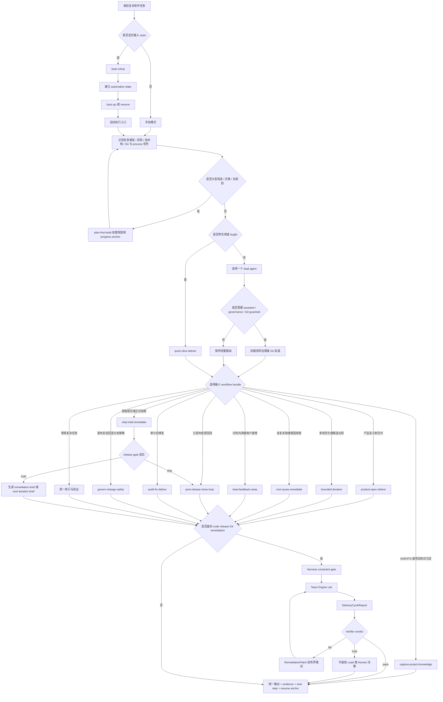

# Virtual Intelligent Dev Team

[](./VERSION)
[](./LICENSE)
[]()
[](./SKILL.md)
[](./references/agent-catalog.md)
[](https://fxbin.github.io/virtual-intelligent-dev-team/architecture.html)
[](./references/language-profiles.yaml)
[]()

> **面向复杂软件工作的闭环协调层**：用六层闭环承接专家路由 · 计划 · 执行 · 迭代 · Beta · Release · Feedback，并在 Delivery closure 内嵌 Team Engine Lite 对抗式验收，以工程约束门禁 · 反熵治理 · 自优化循环保障交付质量。
> 适合接手"单个专家已经不够、单轮回答也不够"的复杂软件任务。

---

## 在线站点

> 文档站使用纯静态 HTML/CSS/JS，可由独立仓库的 GitHub Actions 直接部署到 GitHub Pages。

| 入口 | 说明 | 链接 |
| --- | --- | --- |
| 落地页 | 项目总览：定位 / 痛点 / 六层闭环 / Team Engine Lite / 8 Agent / Quick Start | [fxbin.github.io/virtual-intelligent-dev-team](https://fxbin.github.io/virtual-intelligent-dev-team) |
| 闭环架构 | 六层 Closure、Delivery 子图与 Stage Council overlay | [Architecture](https://fxbin.github.io/virtual-intelligent-dev-team/architecture.html) |
| 工程化四支柱 | Harness 门禁 · Team Engine Lite · 反熵治理 · 自优化循环 | [Engineering](https://fxbin.github.io/virtual-intelligent-dev-team/engineering.html) |
| 8 Agent 角色图谱 | 8 个专家的职责、领域与证据要求 | [Agents](https://fxbin.github.io/virtual-intelligent-dev-team/agents.html) |
| 能力矩阵对比 | 14 个维度对比本项目与普通多专家提示词 | [Matrix](https://fxbin.github.io/virtual-intelligent-dev-team/matrix.html) |

> 独立仓库本地预览：运行 `python -m http.server 8000` 后访问 `http://localhost:8000/docs/`。在 `skill-hub` 根目录启动时，访问 `/virtual-intelligent-dev-team/docs/`。

---

## 项目定位

`virtual-intelligent-dev-team` 是一个面向复杂软件工作的智能协作项目。

它不只是"专家角色路由器"，而是把研发、产品、分轮内测、技术治理、发布门禁、显式 `/auto` 自动运行，以及状态驱动恢复，收拢成一个可持续迭代的闭环工作流。

一句话说：

它适合接手"单个专家已经不够、单轮回答也不够"的复杂软件任务。

---

## 🚀 5 分钟快速上手

### 0. 运行维护脚本前安装依赖

直接调用 skill 不需要额外安装；如果要运行路由、schema、遥测或回归脚本，先执行：

```bash
python -m pip install -r requirements.txt
```

`requirements.txt` 统一声明 `jsonschema` 与 `PyYAML`，避免不同维护环境依赖隐式存在。

### 1. 最简单的使用场景（小切片交付）

```bash
# 场景：实现一个小功能或修复一个 bug
/virtual-intelligent-dev-team 实现用户登录功能的邮箱验证
```

**会发生什么：**
- 自动路由到 `Technical Trinity`（通用后端工程专家）
- 生成 Quick Slice Brief（包含目标、范围、验收条件）
- 实现代码并保留 delivery status 和完成证据
- 给出下一步建议（测试、提交、发布门禁等）

### 2. 模糊想法确认（意图确认）

```bash
# 场景：有一个想法，不确定该从产品、原型、技术还是架构入手
/virtual-intelligent-dev-team 我想做一个用户画像功能
```

**会发生什么：**
- 先给出 5 个确认方向选项：
  - `product-opportunity`：产品机会验证
  - `prototype-exploration`：原型探索
  - `technical-feasibility`：技术可行性评估
  - `architecture-risk`：架构风险分析
  - `delivery-plan`：交付拆解
- 用户选择后，路由到对应的 Lead Agent 或 Workflow Bundle

### 3. 大重构规划（开发前规划）

```bash
# 场景：需要重构认证系统
/virtual-intelligent-dev-team 重构认证系统，从 Session 改为 JWT
```

**会发生什么：**
- 路由到 `Sentinel Architect`（高风险变更治理）
- 激活 Pre-Development Planning Playbook
- 生成 Planning Pack（包含阶段计划、通道笔记、进度锚点）
- 提供多阶段执行路径和回滚点

### 4. 产品定义（产品发现专家团）

```bash
# 场景：定义产品 PRD
/virtual-intelligent-dev-team 帮我定义一个知识管理产品的 PRD
```

**会发生什么：**
- 路由到 `World-Class Product Architect`
- 激活 `product-discovery-council`（产品发现专家团）
- 提供产品战略模板、用户研究模板、竞品分析模板
- 生成结构化 PRD

### 5. 自动化运行（显式 /auto）

```bash
# 场景：自动化执行多轮优化
/virtual-intelligent-dev-team /auto 优化 API 响应时间
```

**会发生什么：**
- 进入 Setup → Go 两阶段协议
- 先建立 automation state（包含目标、检查点、恢复锚点）
- 执行有边界的迭代优化
- 保留状态文件供后续 resume

---

## 项目定位

这个项目最适合三类问题：

- 复杂研发交付
  - 例如小切片实现、大重构、迁移、跨模块联动、技术治理
- 产品与研发协同
  - 例如需求澄清、验收标准、前后端协作、分轮 beta
- 模糊想法分流
  - 例如用户只给出一个猜想，不确定该做产品验证、原型探索、技术可行性、架构风险还是交付拆解
- 版本与闭环治理
  - 例如多轮优化、release gate、post-release feedback loop、resume

## 为什么不是普通多专家提示词

很多“虚拟团队”方案，主要解决的是“换几个角色来回答”。

这个项目想解决得更深一层：

- 不只换角色
  - 还要判断谁主负责、谁协同、是否需要治理
- 不只给建议
  - 还要给出执行路径、恢复锚点和下一步
- 不只做开发前
  - 还覆盖 beta、release、post-release feedback
- 不只做单轮问答
  - 还支持有边界的多轮优化和状态恢复

所以它更像一个“复杂软件工作的闭环协调层”，而不是一个“多身份回答器”。

## 适合解决什么问题

- 复杂研发任务的 lead agent 路由与协同
- 模糊猜想的意图确认反问：先让用户在 `product-opportunity`、`prototype-exploration`、`technical-feasibility`、`architecture-risk`、`delivery-plan` 中确认方向，确认后才把 provisional route 收敛成最终路线
- 大型重构、迁移、拆分、技术治理
- 多轮优化、benchmark、回滚、resume
- 产品定义、验收标准、分轮 beta 内测
- 产品发现专家团与原型设计专家团：在 `product-spec-deliver` 内按需展开阶段内 specialists，但不替换顶层 lead
- release gate 与 post-release feedback loop
- 完成证据门禁：`done / ready / ship / handoff` 之前必须有结构化 completion evidence，且 `evidence_refs` 要能指向可验证命令或本地 artifact
- trigger health 与 workflow quality baseline，避免该触发不触发、误触发、过度流程化或 completion claim 证据不足
- goal framing：对宽目标、重复失败、release、beta、multi-agent 等任务先锁定 success evidence、stop condition 和 non-goals
- anti-entropy governance：对 fallback growth、duplicate owner、adapter / guard 膨胀、delete vs compat 和 source-of-truth 删除边界做治理
- 显式 `/auto` 自动运行与状态优先恢复
- Team Engine Lite 的 Worker / Verifier 分离、RemediationPatch 和 DeliveryCycleReport
- 受控真实 Subagent runtime eligibility：显式 multi-agent/subagent 请求或合格 `/auto` 工作流可生成 `SubagentRuntimePlan`；请求候选上限与宿主原子能力链共同决定 runtime tier，任一能力缺失都会 fail closed 到更低层级
- 文件交接与完成证据：WorkOrder、ImplementationOutput、VerificationReport、RemediationPatch、DeliveryCycleReport 必须落到可校验文件；路径身份、角色方向、带时区时间戳和 schema 任一不符都会阻断验收
- 结构化 Response Pack：Markdown 与 JSON sidecar 同步生成，scope boundary、runtime evidence、Team Engine 与 resume 信息可直接被 benchmark、automation 和 release gate 消费

## 核心能力

- `默认手动模式`
  - 默认是人工驱动模式，不会擅自进入自动运行。
- `显式 /auto`
  - 只有显式输入 `/auto` 才会进入自动运行分支。
- `setup -> go`
  - 自动运行保持两阶段协议，先建状态，再执行。
- `safe / background / resume`
  - 自动子协议支持安全预演、后台执行、状态恢复。
- `状态优先恢复`
  - 恢复优先读取机器可读的 automation state，而不是靠对话猜测上下文。
- `小切片交付`
  - 小型功能或 bugfix 默认保留 quick slice brief、project context、delivery status 和验证证据。
- `意图确认`
  - 低信息量或模糊猜想不会直接硬路由，会先给出目标 lead / workflow bundle / stage council 选项，让用户确认切入方向。
- `目标边界`
  - 对容易漂移的任务先形成 goal frame，明确 success evidence、stop condition、non-goals 和当前 stop state。
- `工作流质量基线`
  - 用 trigger accuracy、fast-path cheapness、output compactness、evidence freshness、artifact laziness 和 authority boundary 约束 skill 迭代。
- `反熵治理`
  - 遇到 duplicate owner、fallback、adapter、guard 或兼容路径增长时，先判断旧路径该删除、保留兼容，还是需要用户确认。
- `Team Engine Lite`
  - 作为 Delivery closure 内的交付子图，为 code-facing、release-facing、Git-facing 与 remediation 路线保留 Worker / Verifier 分离、max-cycle retry、RemediationPatch 和 DeliveryCycleReport。
- `受控真实 Subagent runtime eligibility`
  - 显式 multi-agent / subagent / parallel agent 请求会生成受控计划、角色边界、spawn policy、merge policy 和 fallback；`spawn / wait / merge` 或 `create_session / kill_session / restart_session` 必须完整成链，且不得超过请求候选上限，否则自动降级。
- `外部 Agent 后端软编排`
  - 可以把 Codex / Claude Code / OpenCode 当作角色后端，但默认只声明 `soft_orchestration_only`，不虚假声称真实异步多进程 runtime。
- `有边界的迭代优化`
  - 优化循环是有边界、有证据、有回滚点的，不做无限自转。
- `完成证据门禁`
  - 非平凡完成声明必须保留 action、result、covered scope、uncovered scope、residual risk、confidence grade 和 evidence refs；release gate 会拒绝只有 benchmark 绿、但缺少完成证据的 `ship`。
- `发布与反馈闭环`
  - 不只做发布前 gate，也覆盖发布后的反馈回写与下一轮修复入口。
- `阶段专家团`
  - 产品战略、PRD、用户研究、竞品、指标、路线图等请求可激活 `product-discovery-council`；高保真原型、设计系统、可运行 HTML 原型与可访问性审查可激活 `prototype-design-council`。两者都是 `World-Class Product Architect` 下面的 overlay，不会把简单任务升级成新顶层团队。
- `Harness 工程约束门禁`
  - 6 个 code-facing bundle（plan-first-build / product-spec-deliver / audit-fix-deliver / govern-change-safely / root-cause-remediate / direct-execution）执行前必须创建 `.vidt/harness/engineering-constraints.md`，含 Scope / Non-Negotiable Constraints / Forbidden Changes / Verification Evidence / Rollback And Stop Conditions 五个必填章节，把"实现前先约束"变成硬门禁。
- `Team Engine Lite 对抗式验收`
  - Worker 只产不验、Verifier 只验不产、Lead 只能基于 DeliveryCycleReport 接受；14 个合法状态（含 `spec_violation / human_resolved / resumed`）+ 5 个标准对象（WorkOrder / ImplementationOutput / VerificationReport / RemediationPatch / DeliveryCycleReport）；3 级 runtime claim（real_subagent_runtime / single_backend_multi_session / soft_orchestration_only）禁止把角色扮演误称为真实多 Agent runtime。
- `Fail-closed 证据链`
  - breaker、Verifier、file handoff、Team Engine drill 和 stress gate 默认拒绝不完整或不可重放的证据；Response Pack sidecar 固化 scope boundary、runtime evidence、covered / uncovered scope 与 residual risk。
- `Anti-Entropy 反熵治理`
  - 遇到 duplicate owner、fallback、adapter、guard 或兼容路径增长时，先分类（code-retirement / contract-carrying-code / derived-state / persistent-state），再选路径（delete-first / compat-exception / confirmation-first），未知依赖不等于活跃依赖证据。
- `Self-Optimization 自优化循环`
  - bounded iteration + mutation catalog + offline loop drill：可对自身的 `routing-rules.json` / `regression-cases.json` / `evals.json` 做 JSON-aware 确定性自优化；live ≤3 轮、offline ≤120 轮、same-hypothesis ≤2 次重试；`rollback / keep / pivot / resume / hold→bootstrap→auto-run` 路径均可离线 drill 验证。

## 能力矩阵

| 维度 | 本项目提供什么 | 普通多专家提示词常见缺口 |
| --- | --- | --- |
| 任务路由 | 选择主负责人、协同者、治理轨道 | 往往只是平铺多个角色视角 |
| 日常交付 | 小切片 brief、项目上下文、状态锚点 | 容易直接跳到实现，缺少可恢复上下文 |
| 执行模式 | 支持手动模式与显式 `/auto` | 通常没有明确模式切换 |
| 恢复能力 | 状态优先恢复、resume、恢复锚点 | 容易依赖上下文记忆 |
| 迭代能力 | 有边界的多轮优化、基线、回滚决策 | 常见问题是无限"再来一轮" |
| 发布治理 | release gate、completion evidence、hold 后续修复入口 | 常停留在"建议发/不发"或只看 benchmark 结果 |
| 上线后闭环 | post-release feedback loop | 很少覆盖上线后的反馈回写 |
| 产品协同 | 支持产品、研发、技术治理联动 | 容易偏单一研发视角 |
| 阶段专家团 | 产品发现与原型设计可按需展开 council overlay | 常见做法要么单专家过载，要么所有任务都进重流程 |
| Beta 验证 | 分轮内测、模拟用户、cohort ramp、反馈门禁 | 通常只有静态测试计划，没有结构化分轮验证 |
| 工作流质量 | 触发健康、快路径廉价、证据新鲜度、artifact 懒创建、authority boundary | 容易越改越重，或把方法建议误说成最终权威 |
| Subagent runtime | 请求候选上限 + 六项原子能力证据 + smoke test 共同决定三级 runtime，缺一即降级 | 容易把单个能力标志或角色扮演误称为真实多 Agent runtime |
| 离线验证 | offline loop drill 验证回滚与恢复路径 | 很少验证关键闭环路径是否真的跑通 |
| 工程约束门禁 | code-facing bundle 执行前必须创建 `.vidt/harness/engineering-constraints.md`，含 5 个必填章节 | 通常直接进入实现，缺少前置约束门禁 |
| 对抗式验收 | Worker/Verifier/Lead 分离 + DeliveryCycleReport + 14 状态机 + `spec_violation` | 自产自审，或把角色扮演误称为真实多 Agent runtime |
| 证据链 | 精确 file handoff + schema 校验 + Response Pack JSON sidecar + fail-closed gate | 证据靠自然语言转述，无法稳定重放或被下游消费 |
| 反熵治理 | delete-first / compat-exception / confirmation-first 三路径决策 + 4 类目标分类 | 不断加 fallback 或 guard，旧路径永不退休 |
| 自优化循环 | bounded iteration + mutation catalog + offline drill，可对自身 routing/evals 做确定性自优化 | 无自优化能力，或陷入"再来一轮"的无限自转 |

## 快速开始

如果你第一次使用，建议从这三种方式开始：

```text
$virtual-intelligent-dev-team 帮我接管这次重构，并给出可执行分工。
$virtual-intelligent-dev-team /auto setup 这个项目级迁移。
$virtual-intelligent-dev-team 判断当前版本是否可以 release。
```

对应的理解方式是：

- 不带 `/auto`
  - 走手动模式，适合高风险任务和需要逐轮确认的场景
- 带 `/auto setup`
  - 先建立自动化状态和恢复锚点
- 再执行 `/auto go`
  - 进入自动执行阶段

## 适合与不适合

更适合：

- 复杂研发任务
- 跨产品与研发的交付协同
- 需要多轮优化、恢复和发布治理的工作

不太适合：

- 纯商业战略
- 融资、定价、泛咨询
- 非软件交付型的轻量一次性问题

## 目录结构

```text
virtual-intelligent-dev-team/
├── SKILL.md
├── README.md
├── VERSION
├── LICENSE
├── agents/
├── assets/
├── docs/
├── evals/
├── references/
├── scripts/
└── tests/
```

目录职责分层：

- `SKILL.md`
  - 运行时契约、触发边界、主流程
- `docs/`
  - 面向维护者与开源使用者的说明文档
- `references/`
  - 路由规则、playbook、schema、真源细则
- `assets/`
  - 模板、样例、卡片
- `scripts/`
  - 校验、导出、自动运行、恢复、发布辅助脚本
- `tests/`
  - 语义回归与契约测试

## 快速入口

- 使用说明：
  - [docs/usage-guide.md](docs/usage-guide.md)
- 设计理念：
  - [docs/design-philosophy.md](docs/design-philosophy.md)
- 文档索引：
  - [docs/README.md](docs/README.md)
- 端到端示例：
  - [assets/end-to-end-example.md](assets/end-to-end-example.md)

如果你想先上手：

- 读 `README.md`
- 再读 `docs/usage-guide.md`

如果你想先理解设计：

- 读 `docs/design-philosophy.md`
- 再读 `SKILL.md`

## 运行流程图


```mermaid
flowchart TD
    A[收到复杂软件任务] --> B{是否显式输入 /auto}
    B -->|否| C[手动模式]
    B -->|是| D["/auto setup"]
    D --> E[建立 automation state]
    E --> F["/auto go 或 resume"]
    F --> G[自动执行入口]

    C --> H[识别任务类型 / 风险 / 技术栈 / Git 与 process 信号]
    G --> H

    H --> I{是否大型改造 / 迁移 / 先规划}
    I -->|是| J["plan-first-build 前置规划和 progress anchor"]
    J --> H
    I -->|否| K{是否窄实现或 bugfix}
    K -->|是| L[quick-slice-deliver]
    K -->|否| M[选择一个 lead agent]

    M --> N{是否需要 assistant / governance / Git guardrail}
    N -->|是| O[加载协同治理或 Git 轨道]
    N -->|否| P[保持轻量路由]
    O --> Q{选择最小 workflow bundle}
    P --> Q
    L --> Q

    Q -->|产品定义到交付| R[product-spec-deliver]
    Q -->|多轮优化或候选比较| S[bounded iteration]
    Q -->|反复失败或根因排查| T[root-cause-remediate]
    Q -->|分轮内测或用户递增| U[beta-feedback-ramp]
    Q -->|发版提交或正式验收| V[ship-hold-remediate]
    Q -->|已发布反馈回流| W[post-release-close-loop]
    Q -->|审计后修复| X[audit-fix-deliver]
    Q -->|发布安全回滚分支策略| Y[govern-change-safely]
    Q -->|AGENTS 或项目知识沉淀| Z[capture-project-knowledge]
    Q -->|常规复杂任务| AA[统一执行与验证]

    R --> AB{是否面向 code release Git remediation}
    S --> AB
    T --> AB
    U --> AB
    V --> AC{release gate 结论}
    W --> AB
    X --> AB
    Y --> AB
    AA --> AB
    Z --> AK[统一输出 + evidence + next step + resume anchor]

    AC -->|ship| W
    AC -->|hold| AD[生成 remediation brief 或 next iteration brief]
    AD --> AB

    AB -->|是| AE[Harness constraint gate]
    AE --> AF[Team Engine Lite]
    AF --> AG[DeliveryCycleReport]
    AG --> AH{Verifier verdict}
    AH -->|pass| AK
    AH -->|fail| AI[RemediationPatch 加有界重试]
    AI --> AF
    AH -->|hold| AJ[升级给 Lead 或 Human 决策]
    AJ --> AK

    AB -->|否| AK
```

**流程图与四大工程化支柱的映射**：

- **Harness 工程约束门禁** → `AE` 节点：code-facing bundle 进入实现前必须经过此门禁
- **Team Engine Lite 对抗式验收** → `AF` / `AG` / `AH` / `AI` 节点：Worker 产出 → Verifier 验收 → Lead 基于 DeliveryCycleReport 接受
- **Anti-Entropy 反熵治理** → 贯穿 `N` / `O` 节点：加载协同治理轨道时触发 delete-first / compat-exception / confirmation-first 路径选择
- **Self-Optimization 自优化循环** → `AI` 节点的"有界重试"体现了 bounded iteration 原则；skill 自身的 routing/evals 优化通过 offline loop drill 离线执行，不在此用户任务流程图中

## 如何调用

最常见的调用方式：

```text
$virtual-intelligent-dev-team 帮我接管这次重构，并给出可执行分工。
$virtual-intelligent-dev-team /auto setup 这个项目级迁移。
$virtual-intelligent-dev-team 判断当前版本是否可以 release。
```

如果你主要关心运行时规则，优先读：

- `SKILL.md`
- `references/playbook-index.md`
- `references/tooling-command-index.md`

如果你主要关心维护和扩展，优先读：

- `README.md`
- `docs/README.md`

## 校验命令

项目级：

```bash
python3 validate.py --changed
```

skill 级：

```bash
python3 ../scripts/sync_virtual_intelligent_dev_team_version.py --check
python3 ../scripts/sync_virtual_intelligent_dev_team_version.py
python3 skill-forge/scripts/quick_validate.py ./virtual-intelligent-dev-team
python3 -m unittest virtual-intelligent-dev-team.tests.test_routing_and_guardrails
python3 virtual-intelligent-dev-team/scripts/validate_virtual_team.py --pretty
```

## 版本

当前版本见 [VERSION](VERSION)。

## 致谢与参考来源

本项目的迭代优化模式部分参考了 [agency-agents](https://github.com/msitarzewski/agency-agents) 的设计思路，并在其基础上适配了本 skill 的闭环工作流、状态恢复与发布治理等能力。

相关的模式提炼见 [references/bounded-iteration-patterns.md](references/bounded-iteration-patterns.md)。

## License

本项目使用 [MIT License](LICENSE)。
