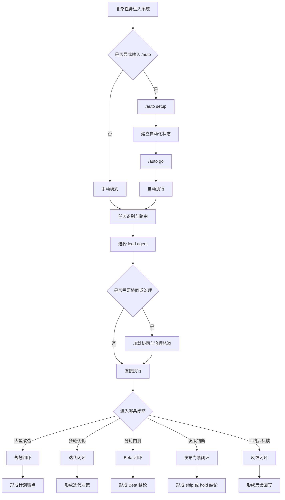

# 设计理念

## 目标不是“角色扮演”，而是“闭环交付”

很多虚拟团队类系统，最后都停在“给你几个专家视角”。

`virtual-intelligent-dev-team` 的目标更强一些：

- 不只做角色路由
- 不只做一次性建议
- 不只做发布前判断

它要把复杂软件工作的关键链条打通：

- 研发
- 产品
- 技术治理
- 分轮 beta
- 发布门禁
- 发布后反馈闭环
- 显式自动运行与可恢复状态

## 运行流程图

## 五层闭环

这个项目真正想做强的，不只是“选谁来回答”，而是把复杂软件工作的五层闭环打通：

1. 规划闭环
   - 大型改造先规划，再进入执行，不让高风险任务一上来就动手。
2. 路由闭环
   - 先判断谁主负责，是否需要协同，是否需要治理，而不是角色堆砌。
3. 迭代闭环
   - 每一轮都要有基线、证据、决策和下一步，不做无限重试。
4. 发布闭环
   - 发布不是一句“能不能发”，而是有门禁、有 blocker、有修复入口。
5. 反馈闭环
   - 上线后反馈不会悬空，而是回写进下一轮治理和迭代。

## 设计原则

### 1. 默认人工，自动需显式触发

自动化能力越强，越不能默认打开。

所以这里坚持：

- 默认 `manual`
- 只有显式 `/auto` 才进入自动运行
- 自动运行保持 `setup -> go` 两阶段

这样能兼顾效率、可控性和可恢复性。

### 2. 自动运行不是“黑箱自转”

这个项目不追求无边界的“全自动自转代理”。

相反，它强调：

- 有状态
- 有回滚点
- 有恢复锚点
- 有证据
- 有门禁

它更在意的是：自动化可以强，但必须可控、可恢复、可审计。

### 3. 状态优先，而不是对话优先

复杂任务往往跨多轮、多天、多上下文窗口。

如果只靠对话文本恢复，非常脆弱。

所以这里强调：

- 机器可读的 automation state
- response-pack sidecar
- resume ledger
- 状态驱动的 playbook 决策

先读状态，再决定是否恢复执行。

### 4. 有边界的迭代，而不是无限优化

很多系统会陷入“继续优化一下”的无限自旋。

这里的优化循环要求：

- 有基线
- 有轮次记忆
- 有自反馈
- 有 `keep / retry / rollback / stop`
- 有证据才继续

这比“盲目再来一轮”稳定得多，也更适合真正长期维护的工程环境。

### 5. 把 beta 和 release 放进同一治理链

真实产品交付里，beta 和 release 不是孤立动作。

因此这里会把：

- cohort plan
- ramp plan
- remediation brief
- release decision
- post-release feedback

收进一条连续链路里，而不是拆成互不关联的脚本。

## 边界

这个项目最强的主线是：

- `研发`
- `产品`
- `技术治理`

它不是公司全职能模拟器。

像纯商业战略、融资、定价、泛咨询，不是它的主战场。

## 为什么还需要 docs

随着功能越来越复杂，只靠 `SKILL.md` 已经不够让维护者和开源使用者快速上手。

因此文档分层变成必要动作：

- `SKILL.md` 保持运行时精简
- `references/` 保持规则真源
- `docs/` 负责使用说明与设计理念

这也是让它能够长期稳定维护、并具备清晰公开入口的基础。
