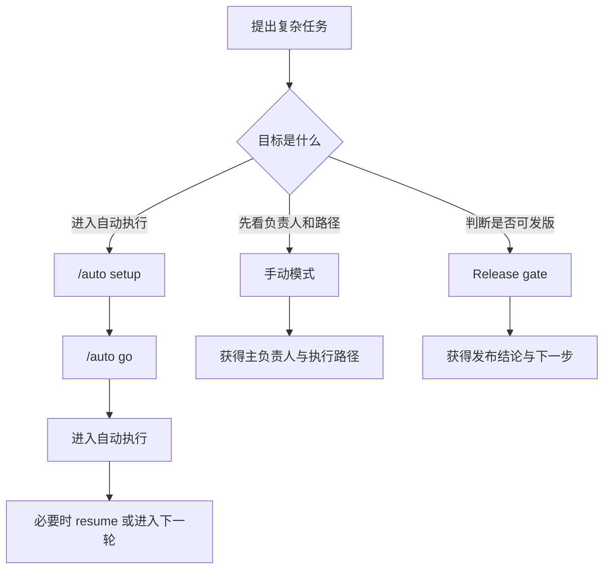

# 使用说明

## 一句话理解

`virtual-intelligent-dev-team` 适合接管复杂软件工作，把“专家路由 + 计划 + 执行 + 迭代 + beta + release + feedback”收拢成一个统一闭环。

## 三种最常见入口

你通常会从下面三类入口进入：

1. 让我接管一个复杂任务
   - 例如重构、迁移、架构梳理、跨团队协同
2. 让我进入自动模式
   - 先 `/auto setup`，再 `/auto go`
3. 让我判断当前版本能不能发
   - 进入 release gate

## 最小上手路径

如果你只想先跑通一次，建议按这个顺序理解：

1. 先用手动模式发起一次复杂任务
2. 再尝试 `/auto setup`
3. 最后在需要时使用 `/auto go` 或 `resume`

最小示例：

```text
$virtual-intelligent-dev-team 帮我评估这次重构的最佳负责人和执行顺序。
$virtual-intelligent-dev-team /auto setup 这个项目级迁移。
$virtual-intelligent-dev-team /auto go
```

## 什么时候用

- 任务跨研发、产品、技术治理多个领域
- 你不确定应该让谁 lead
- 任务需要多轮优化、版本比较、基线追踪
- 任务上线前后都需要更正式的 gate 和反馈回写
- 任务规模较大，想先规划再执行

## 默认模式

默认是 `manual`。

这意味着：

- 不会默认进入自动运行
- 更适合对高风险任务逐轮确认
- 输出重点是 lead route、workflow bundle、resume anchor、下一步建议

示例：

```text
$virtual-intelligent-dev-team 帮我评估这次重构的最佳负责人和执行顺序。
```

## 自动模式

只有显式输入 `/auto` 才进入自动模式。

自动模式采用两阶段：

1. `/auto setup`
2. `/auto go`

这样做的原因是先把自动化状态建好，再进入执行，便于后续 `resume`、`safe`、`background` 与审计。

示例：

```text
$virtual-intelligent-dev-team /auto setup 这个项目级迁移。
$virtual-intelligent-dev-team /auto go
```

## 常见工作路径

### 1. 复杂研发任务

适合：

- 架构重构
- 大型迁移
- 多模块联动改造

典型结果：

- 主负责人
- 协同搭配
- 计划 / 执行 bundle
- 风险与验证路径

### 2. 分轮 beta 内测

适合：

- 需要小流量逐轮放量
- 想模拟不同类型内测用户
- 想把每轮反馈结构化沉淀

典型结果：

- cohort plan
- ramp plan
- persona library
- scenario pack
- preview manifest
- beta gate

### 3. release gate

适合：

- 判断当前版本能否发版
- 明确 blockers
- 自动生成 remediation brief

结果不是简单的“能 / 不能发”，而是：

- `ship` 或 `hold`
- 如果 `hold`，要给出下一轮修复入口

### 4. post-release feedback loop

适合：

- 产品上线后收集反馈
- 对反馈分级
- 把高优先级问题回写到下一轮治理闭环

## 一张图理解使用路径



## resume 怎么理解

`resume` 的核心不是“继续聊”，而是“从状态恢复”。

这个项目已经支持：

- machine-readable automation state
- state-first 恢复判断
- playbook 决策
- guarded resume execution
- formal resume execution ledger

这意味着多会话、多轮次、多阶段任务更稳定，不容易因为上下文丢失而重启整个流程。

## 推荐配套文件

如果任务跨多轮或跨多天，建议保留：

- `docs/progress/MASTER.md`
- beta / release / feedback 相关输出
- automation state 与 response pack

## 维护者建议

- 运行时规则改动放 `references/`
- 模板和样例放 `assets/`
- 使用说明和开源文档放 `docs/`
- 不要把 `SKILL.md` 写成超长手册
