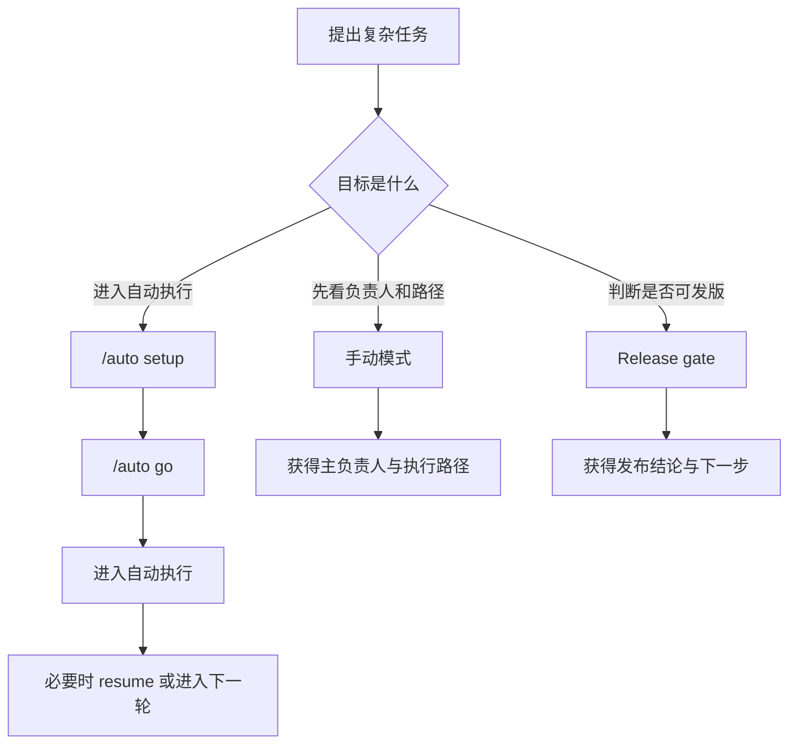

# 使用说明

## 一句话理解

`virtual-intelligent-dev-team` 适合接管复杂软件工作，把“专家路由 + 计划 + 执行 + 迭代 + beta + release + feedback”收拢成一个统一闭环。

## 四种最常见入口

你通常会从下面三类入口进入：

1. 让我接管一个复杂任务
   - 例如重构、迁移、架构梳理、跨团队协同
2. 让我处理一个明确的小切片
   - 例如小功能、bugfix、窄范围实现和回归验证
3. 让我进入自动模式
   - 先 `/auto setup`，再 `/auto go`
4. 让我判断当前版本能不能发
   - 进入 release gate

## 最小上手路径

如果你只想先跑通一次，建议按这个顺序理解：

1. 先用手动模式发起一次复杂任务
2. 再尝试 `/auto setup`
3. 最后在需要时使用 `/auto go` 或 `resume`

最小示例：

```text
$virtual-intelligent-dev-team 帮我评估这次重构的最佳负责人和执行顺序。
$virtual-intelligent-dev-team /auto setup 这个项目级迁移。
$virtual-intelligent-dev-team /auto go
```

## 什么时候用

- 任务跨研发、产品、技术治理多个领域
- 你不确定应该让谁 lead
- 任务需要多轮优化、版本比较、基线追踪
- 任务上线前后都需要更正式的 gate 和反馈回写
- 任务规模较大，想先规划再执行
- 任务需要把 Worker 和 Verifier 分开，避免同一个 Agent 自产自审

## 默认模式

默认是 `manual`。

这意味着：

- 不会默认进入自动运行
- 更适合对高风险任务逐轮确认
- 输出重点是 lead route、workflow bundle、resume anchor、下一步建议

示例：

```text
$virtual-intelligent-dev-team 帮我评估这次重构的最佳负责人和执行顺序。
```

## 自动模式

只有显式输入 `/auto` 才进入自动模式。

自动模式采用两阶段：

1. `/auto setup`
2. `/auto go`

这样做的原因是先把自动化状态建好，再进入执行，便于后续 `resume`、`safe`、`background` 与审计。

示例：

```text
$virtual-intelligent-dev-team /auto setup 这个项目级迁移。
$virtual-intelligent-dev-team /auto go
```

## 常见工作路径

### 1. 复杂研发任务

适合：

- 架构重构
- 大型迁移
- 多模块联动改造

典型结果：

- 主负责人
- 协同搭配
- 计划 / 执行 bundle
- 风险与验证路径

### 2. 小切片交付

适合：

- 小型功能
- bugfix
- 明确范围的实现切片

典型结果：

- quick slice brief
- project context
- delivery status
- acceptance criteria
- targeted verification evidence

默认初始化：

```bash
python scripts/init_project_context.py --root . --pretty
python scripts/init_quick_slice.py --root . --pretty
```

### 3. 分轮 beta 内测

适合：

- 需要小流量逐轮放量
- 想模拟不同类型内测用户
- 想把每轮反馈结构化沉淀

典型结果：

- cohort plan
- ramp plan
- persona library
- scenario pack
- preview manifest
- beta gate

### 4. release gate

适合：

- 判断当前版本能否发版
- 明确 blockers
- 自动生成 remediation brief

结果不是简单的“能 / 不能发”，而是：

- `ship` 或 `hold`
- 如果 `hold`，要给出下一轮修复入口

release gate 不会只看 benchmark 是否全绿。正式 `ship` 还要求结构化 completion evidence：

- `result.status = passed`
- `confidence_grade = A | B`
- `uncovered_scope` 和 `residual_risk` 没有未解决内容
- `evidence_refs` 至少包含一条可验证命令，或一条已经存在的本地 artifact 路径

最小命令：

```bash
mkdir -p .vidt/evidence && cp assets/completion-evidence-template.json .vidt/evidence/completion-evidence.json
python scripts/verify_completion_evidence.py --evidence .vidt/evidence/completion-evidence.json --pretty
python scripts/run_release_gate.py --output-dir evals/release-gate --completion-evidence .vidt/evidence/completion-evidence.json --pretty
```

动作前预检：

```bash
python scripts/verify_action.py --text "<user request>" --check completion-evidence --completion-evidence .vidt/evidence/completion-evidence.json --pretty
```

### 5. Team Engine Lite 交付验收

适合：

- 代码实现、bugfix、审计修复
- release gate 后的 remediation
- Git 交付或高风险技术治理
- 需要外部 Agent 后端软编排的任务
- 显式要求 multi-agent / subagent / parallel agent，且需要受控 Worker / Verifier / Explorer 分工的任务

关键规则：

- Worker 只能产出实现或修复，不能给自己 `pass`
- Verifier 必须独立输出 `VerificationReport`
- Verifier `fail` 或 `spec_violation` 必须给 `RemediationPatch`，其中 `spec_violation` 还必须引用客观 spec 与证据
- Lead 只能在 `DeliveryCycleReport.next_state = accepted` 后接受结果
- 显式 subagent 请求会先生成候选 runtime tier；宿主只能维持或向下降级，不能越过请求候选上限
- `spawn / wait / merge` 全部有证据并通过 smoke test，才允许使用 `real_subagent_runtime`
- `create_session / kill_session / restart_session` 全部有证据并通过 smoke test，才允许使用 `single_backend_multi_session`
- 任一能力缺失都 fail closed 到更低 tier，最终保底为带 `known-shortcut:` 的 `soft_orchestration_only`
- Lead→Worker、Worker→Verifier、Verifier→Lead 交接必须落到 `.vidt/handoff/` 文件；角色方向、路径身份、带时区时间戳与 schema 都必须通过校验

离线检查：

```bash
python scripts/run_team_engine_drill.py --pretty
```

### 6. post-release feedback loop

适合：

- 产品上线后收集反馈
- 对反馈分级
- 把高优先级问题回写到下一轮治理闭环

## 一张图理解使用路径


```mermaid
flowchart TD
    A[提出复杂任务] --> B{目标是什么}
    B -- 先看负责人和路径 --> C[手动模式]
    B -- 进入自动执行 --> D["/auto setup"]
    B -- 判断是否可发版 --> E[Release gate]
    D --> F["/auto go"]
    C --> G[获得主负责人与执行路径]
    F --> H[进入自动执行]
    E --> I[获得发布结论与下一步]
    H --> J[必要时 resume 或进入下一轮]
```

## resume 怎么理解

`resume` 的核心不是“继续聊”，而是“从状态恢复”。

这个项目已经支持：

- machine-readable automation state
- state-first 恢复判断
- playbook 决策
- guarded resume execution
- formal resume execution ledger

这意味着多会话、多轮次、多阶段任务更稳定，不容易因为上下文丢失而重启整个流程。

## 推荐配套文件

如果任务跨多轮或跨多天，建议保留：

- `.vidt/context/project-context.md`
- `.vidt/delivery/current-slice.md`
- `.vidt/delivery/status.yaml`
- `.vidt/evidence/completion-evidence.json`
- Response Pack Markdown 与同名 JSON sidecar
- `.vidt/handoff/` 下的五类 Team Engine 交接文件
- `docs/progress/MASTER.md`
- Team Engine Lite 的 WorkOrder / DeliveryCycleReport / backend orchestration plan
- beta / release / feedback 相关输出
- automation state 与 response pack

## 维护者建议

- 运行时规则改动放 `references/`
- 模板和样例放 `assets/`
- 使用说明和开源文档放 `docs/`
- 不要把 `SKILL.md` 写成超长手册
