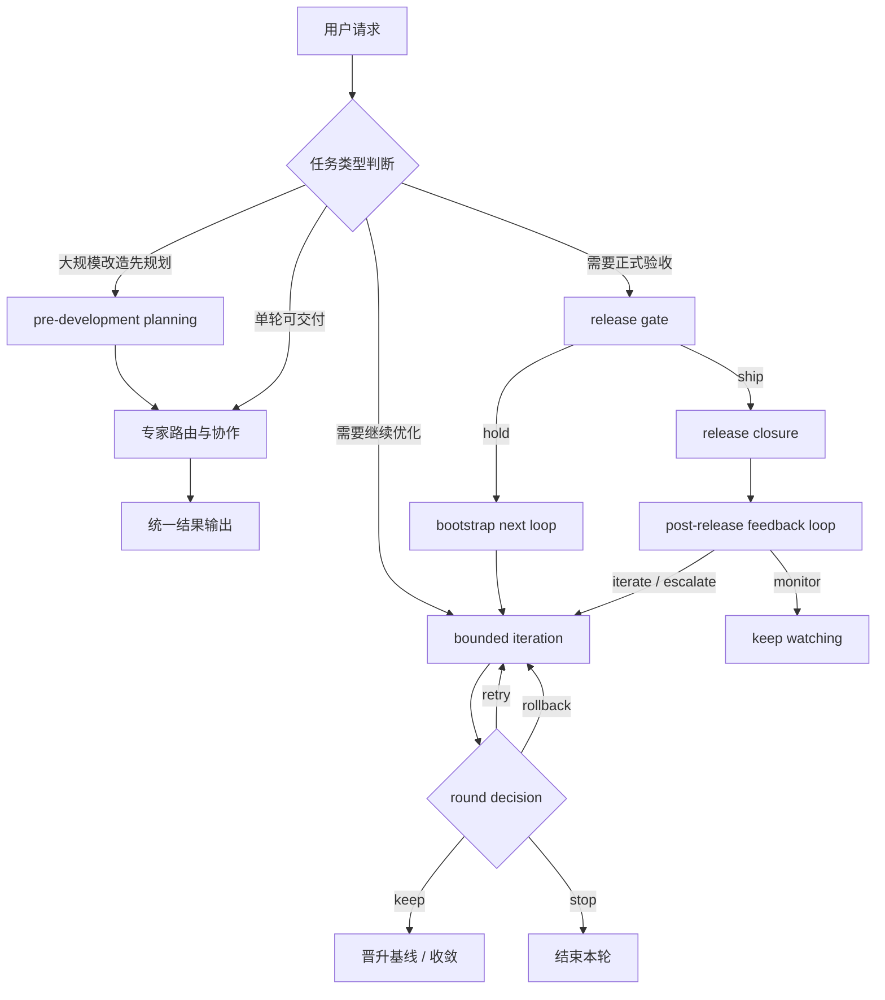
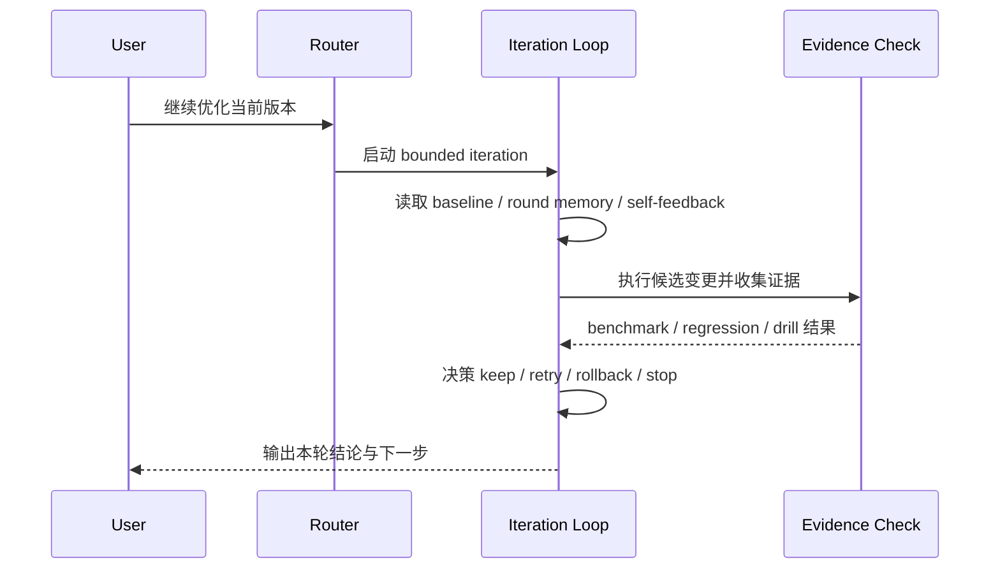
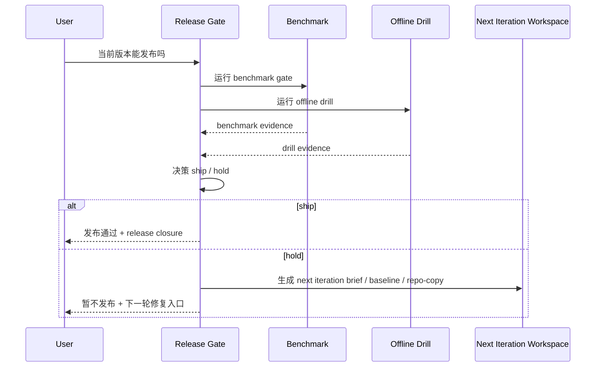

# Virtual Intelligent Dev Team：工作流示意与时序说明

这份文档用于回答一个更具体的问题：

> 这个 skill 在真实工作里，到底是怎么一步一步跑起来的？

它不是实现细节文档，而是一个“执行路径说明”。

---

## 1. 总览：它有 6 条主路径

`virtual-intelligent-dev-team` 的常见执行路径，可以粗分为 6 类：

1. **开发前规划路径**
   - 大规模改造先产出 analysis / plan / progress，再回到执行
2. **路由直达路径**
   - 任务明确，专家分发后直接产出结果
3. **有边界迭代路径**
   - 一轮不够，需要继续优化、比较、回滚或续跑
4. **正式发布验收路径**
   - 不再只是“看起来不错”，而是要判断能不能 `ship`
5. **已发布反馈回流路径**
   - 已经 `ship` 之后，把真实反馈、telemetry 和治理回写重新接回下一轮
6. **显式自动运行路径**
   - 用户明确写 `/auto` 后，先 setup，再 go，把 root-cause / release / post-release 三条链路自动接起来

可以用一个简化图来理解：



---

## 2. 开发前规划路径：先把大改造的边界锁住

当用户不是要“马上改一个点”，而是要：

- “把这个项目迁到新架构”
- “整个服务要重写”
- “先规划再开发”
- “先分阶段，再进实施”

skill 不应该直接跳到实现或迭代，而应该先进入轻量 planning branch。

这条路径的执行顺序通常是：

```text
锁定范围与目标
-> 分析关键架构、模块和风险
-> 拆阶段与任务
-> 建立 docs/progress/MASTER.md 这类进度锚点
-> 再回到正常执行路由
```

关键点是：

- 不是为了写更多文档
- 而是为了给长周期改造建立稳定的恢复点
- 并让后续路由、迭代、release 都有同一个上下文锚点

---

## 3. 路由直达路径：问题清楚时，先把角色分清

当请求本身已经足够明确，且不需要多轮实验时，skill 会先做路由。

典型问题：

- “这个 Java GC 问题谁来处理？”
- “这个 PR 是安全审计优先，还是实现优先？”
- “这个需求涉及前端交互和后端接口，怎么分工？”

这时的执行顺序通常是：

```text
识别任务类型
-> 判断风险和跨域耦合
-> 选择 lead
-> 视情况添加 assistant
-> 必要时挂 governance / git/process guardrail
-> 输出统一结论与下一步动作
```

核心点是：

- 不让多个角色无序切换
- 不把用户暴露在“多段互相打架的回答”里
- 最终仍然是一个统一输出

---

## 4. 有边界迭代路径：当“一轮回答”不够时

如果用户表达的是：

- “继续优化”
- “继续下一轮”
- “评估当前版本还能不能更好”
- “比较几个候选方案”
- “跑 benchmark 后再决定”

那么系统不应该继续做松散对话，而要进入 bounded iteration。

### 简化时序



### 这一条路径的关键，不是“继续试”

而是：

- 每轮有目标
- 每轮有候选变化
- 每轮有证据
- 每轮有明确决策

也就是说，它不是靠“再试一次也许更好”，而是靠：

```text
目标 -> 变更 -> 证据 -> 决策 -> 下一轮
```

### 常见决策含义

- `keep`
  - 当前轮结果有效，保留并可晋升为更优基线
- `retry`
  - 当前方向未完全失效，但还不够好，可以有限重试
- `rollback`
  - 当前轮带来回归或风险，需要回到前一稳定状态
- `stop`
  - 继续迭代的收益不足，或已经达到边界

---

## 5. `pivot` 与 `resume`：为什么它不像普通重试

很多系统的“多轮”其实只是重复同一条思路。  
而这个 skill 的 bounded iteration 多了两条关键能力：

### `pivot`

当同一个假设已经试过多次仍然不成立时，不继续原地打转，而是切换到新的瓶颈。

这意味着：

- 不会在一个坏方向上无限重试
- 能显式记录“这个假设已经耗尽”
- 下一轮可以从新的问题入口继续

### `resume`

如果离线循环中断，不需要整轮推倒重来，而是从持久化状态继续。

这意味着：

- 长循环更可控
- 中断不会丢失上下文
- 不会因为重新开始而重复浪费轮次预算

---

## 6. 正式发布验收路径：不是问“看起来行不行”，而是问“能不能 ship”

当用户问题变成：

- “当前版本可以发布吗？”
- “现在能提交一个版本吗？”
- “这个结果可以 treat as release candidate 吗？”

就不应再只看 benchmark 摘要，而要进入 formal release gate。

### 简化时序



### `ship`

表示当前证据足以支撑“进入发布候选态”。

它不意味着绝对完美，而意味着：

- 关键 gate 已通过
- 当前版本达到阶段性交付标准
- 可以归档 release closure
- 会自动铺设 post-release feedback workspace

### `hold`

表示当前仍有 blocker，不能直接发布。

但 `hold` 不是失败终点，而是下一轮的结构化起点。

它应该带出：

- blocker 信息
- next iteration brief
- failing baseline
- repo-copy
- mutation catalog
- remediation/targets artifacts

也就是说：

```text
hold != 结束
hold = 下一轮修复闭环的入口
```

---

## 7. 为什么这个流程是“有边界”的

这个 skill 不追求“无限自动化”，而追求“受约束的稳定闭环”。

它的边界体现在：

- 有 round cap
- 有证据检查
- 有 rollback
- 有 stop
- 有 hypothesis retry 限制
- 有 stagnation / pivot 机制
- 有 formal release gate 作为阶段性出口

所以它真正的执行哲学是：

> 可以继续迭代，但每一轮都必须解释自己为什么继续，以及继续之后如何判断该停。

---

## 8. 在当前项目里，最容易理解的 3 个用法

### 用法 A：让它先判断谁来主导

示例：

- “这个需求涉及 Java、Git 和 PR review，谁主导合适？”

预期效果：

- lead 明确
- assistant 明确
- 是否需要 governance 明确

### 用法 B：让它继续优化当前版本

示例：

- “评估当前项目里的版本，继续下一轮。”

预期效果：

- 进入 bounded iteration
- 明确 baseline 与本轮目标
- 给出 keep / retry / rollback / stop 决策

### 用法 C：让它判断能不能发版

示例：

- “现在这个 skill 可以发布了吗？”

预期效果：

- 进入 release gate
- 明确 `ship` 或 `hold`
- 若 `hold`，自动给出下一轮修复入口

---

## 9. 一句话总结

如果 `skill-positioning.md` 解释的是“它是什么”，  
那么这份文档解释的是“它怎么跑”。

可以把它概括成一句话：

> `virtual-intelligent-dev-team` 会先完成专家路由；如果任务进入多轮优化，则切换到 bounded iteration；如果任务进入正式验收，则切换到 release gate，并在 `hold` 时自动铺设下一轮修复路径。

如果版本已经 `ship`，下一条链路就是 post-release feedback loop：把真实世界里的反馈、监控和治理变化再接回下一轮。

---

## 10. 显式自动运行路径：只在用户明确 `/auto` 时开启

`/auto` 不是默认行为，也不是无限自循环。

它的时序是：

```text
/auto
-> route_request 识别支持的 workflow
-> run_auto_workflow.py --mode setup
-> 生成 .skill-auto/auto-run-plan.json / .md
-> 生成 .skill-auto/state/*.json
-> 用户或上层流程显式 go
-> run_auto_workflow.py --mode go
-> 接到底层 iteration / release gate / post-release evaluator
```

关键约束：

- 默认仍是 manual mode
- 只开放给：
  - `root-cause-remediate`
  - `ship-hold-remediate`
  - `post-release-close-loop`
- 必须先 `setup`，再 `go`
- 自动运行结果也必须带 resume anchor
- `safe / background / resume` 是叠加子协议：
  - `safe` 收紧 stop cap
  - `background` 只要求 resumable state，不代表 daemon
  - `resume` 优先复用最近一次 plan / state
